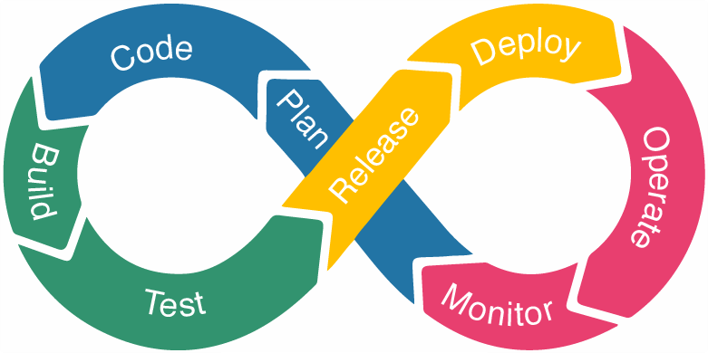
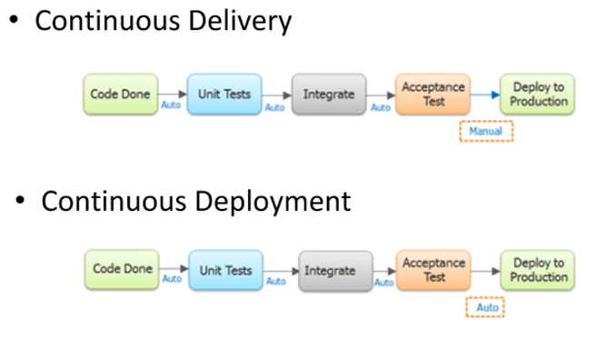
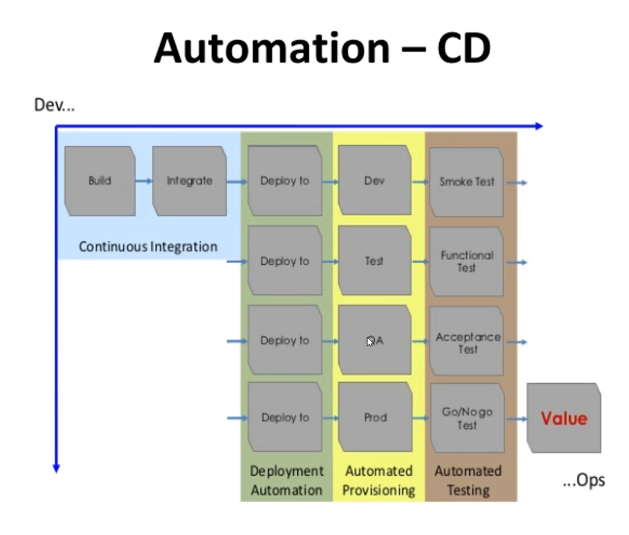
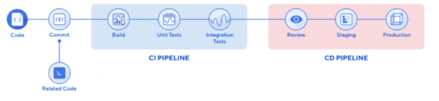

# CI/CD

### INTRODUCTION TO CI/CD

Software development life cycle.

- The process of automating tasks from development, testing to deployment with less time and lower cost. CI merge all developers working copies to a shared machine. CD functionality is added and deployed automatically if it works.

- CI/CD or CICD generally refers to the combined practices of continuous integration and either continuous delivery or continuous deployment.

- CI/CD bridges the gaps between development and operation activities and teams by enforcing automation in building, testing and deployment of applications.

- CI/CD is considered as the backbone of DevOps practices and automation. It plays vital, challenging and exciting role in DevOps culture, growing numbers of companies releasing software in minutes with the adoption of CICD practices.

Companies that use CICD pipelines:

- Facebook
- Netflix
- HP
- Adobe

- 4 Pillars: ease of use, flexibility, robustness and cost.
- DevOps helps software development and deployment SDLC.

### Software Development Life Cycle (SDLC)

- Plan/Design
- Develop
- Test
- Deploy

Nothing gets deployed without testing. We have to make sure the code is going to work before put in front of the clients.

- Problems in traditional SDLC:

    - Scale and complexity
        - Functions
        - Architecture
        - Infrastructure
        - Developers
        - Operations
    - Manual and slow process
    - Broken communication
    - Human errors
    - Large volume of testing
    - Long deployment window
    - High cost
    - Customer dissatisfaction

You debug and it doesn't work, so you lost money and wasted your time.

### DevOps in SDLC:

- DevOps came to help modern SDLC - Agile. It brings:

	- Collaboration
	- Automation
	- Iterative

- DevOps Lifecyle:



### DevOps Lifecycle Stages

How do we implement it?

- Continuous Development
- Continuous Testing
- Continuous Integration
- Continuous Delivery/Deployment
- Continuous Monitoring

__Continuos Integration (CI):__

Is the practice of merging all developers' working copies to a shared mainline several several times a day:

- Development
- Testing
- Integration

(MORE OR LESS LIKE WE DID IN OUR PROJECT WITH GIT/AGILE(DRAWING))


Process: build, test it, test done, report it, come to your source control.

__Continuos Delivery (CD or CDE):__

Is a software enginerring approach in which teams produce software in short cycles, ensuring that the software can be reliably released at any time and, when releasing the software, doing so __manually__.

__Continuos Deployment (CD):__

Is a software engineering approach in which software functionalities are delivered frequently through __automated__ deployments.



How CICD Practices relate to each other: 

To put it simply, the continuous integration is part of both continuous delivery and continuous deployment. The main difference is the deployment step, in continuous delivery the deployment is done manually and in continuous deployment it happens automatically.



The important thing to understand it, is who is involved here.
QA: Quality assurance -> make sure that the test was done.
PROD: means in front of the client.

### CI/CD Pipeline

The CI/CD pipeline is all about automation: Initiating code builds, automated testing, and automated deploying to the staging or production environments. It’s complex and exciting at the same time, but incredibly fast, if the output of any stage fails, the next stage will also fail.

A CI/CD pipeline automates your software delivery process. The pipeline builds code, runs tests (CI), and safely deploys a new version of the application (CD).

Automated pipelines remove manual errors, provide standardized feedback loops to developers, and enable fast product iterations.



Pipeline phases:

1. Commit
2. Build
3. Automate tests
4. Deploy

Scene: we have the code, we will commit from our local host, to trigger the build, the build will trigger, will do the testing, one the testing is passed it will integrate the code for us. In cd, we will review the code, and one test is passed, we will deploy to production.

This, automate testing and automate deployment help us to save time.

Everything, we will do, DevOps.


We will use Jenkins to create CI/CD pipeline, but there are more options like Bamboo. Both work in the same way. Similar.

### Why CI/CD matters (Benefits):

- Reduce cost
- Faster release rate
- Smaller code changes
- Fault isolations
- More test reliability
- Increase team transparency and accountability
- Easy maintenance and updates

### Conclusion

What do I help as DevOps?

- Culture
- People/teams
- Collaboration
- Principles
- Automation tools
- SDLC
- System quality
- Cost efficiency
- Business value

We bring a good culture, faster development, Agile, DevOps practices.

We are amazing people that everyone have to talk with all of us, with testers, operations, developers, etc. 

Everyone need to communicate with us. Also we need to communicate with them. We should be able to explain any technical topic in a nice way that they can understand.

We are highly in demand.

Summary: we develop something and we test it before we release it.

### Jenkins


STEPS:

1. Clone the repository: `git clone https://github.com/name/repository.git`
2. Delete .git `rm -rf .git`
3. And create your own repository where you will push this code.
4. Open a terminal and go to ssh folder: `cd ~/.ssh/`
5. Create a new key: `ssh-keygen -t ed25519 -C "your_email@hotmail.com"` (Command for Ubuntu). Tag with a relevant name.
6. Copy your public key: `cat namekey.pub`. Copy the output.
7. Go to your repository in github. Select `Settings` tab. Select `Deploy keys` section.
8. Click on `Add new key`. Copy the public key and put a relevant name. Click on `Add key`.
9. Go to Jenkins server and log in.
10. Click `New Item`. 
11. Enter an item name: `jose_CI`. Select the option `Freestyle project`. Click `Ok`.
12. Description: `Whatever you want, relevant for the task.` (Building continuos integration by cloning the repository from github).
13. Tick `Discard old builds`. In `Maxim of builds to keep` enter `2`.
14. Tick on `GitHub Project`. Copy the https from your repository and paste it in the gap `Project url`.
15. In the option `Office 365 Connector`, we want to restrict, so tick on `Restrict where this project can be run`. In the `label expression` select the correct node where you want to run it.
16. In `Source Code Management`, we use Git. Go back to your repository and copy the ssh link. Go back and Jenkins and past it the `Repository URL`.
17. Now, we need the credentials. Click on `Add`.
18. Click on `Kind` and select the option of SSH.
19. Open a terminal and go to ssh folder: `cd ~/.ssh/`. Now we need copy our private key.
20. Come back to jenkins and paste it the section of `Private key`. Add a username to identify later your key. Click on `Add`.
21. So, in `Credentials` select the key that we have added. It should resolve any problem.
22. In `Branch Specifier` change to `*/main`.
23. In `Build Triggers`, tick on `GitHub hook trigger for GITScm polling`.
24. In `Build Environment`, tick on `Provide Node & npm bin/ folder to PATH`. Leave that at it is.
25. In `Build`, select the option `Execute shell` and add the following commands: 

````
cd app
npm install
npm test
````

Jenkins is going to clone the repository and go to app folder and run the commands. It will automate the tests.

26. Click on `Apply` and then `Save`.
27. Let's go and click on `Build now`. When it has finished, check if it passed all the tests and the app is running. It did everything for us. Jenkins go to github and clone the repository using the key.
28. Let's go back to the repository in github. Click on `Settings`.
29. Click on `Webhooks`. Use of webhooks that are triggered on github push. Note: we need to enable Github webhooks on the Jenkins Project.
30. Copy the IP of your jenkins server including the port.
31. Click on `Add webhook`
32. In URL: `http://ip:port/github-webhook/`.
33. In type select `json`.
34. Tick on `send me everything`. And finally `Add webhook`.
35. Open your terminal, go to the folder of your repository.
36. Make some changes (for example, modify readme). Push it.
37. Github receive the change, the webhook is going to listen it and trigger the build in jenkins, so jenkins is going to do the rest (run the test and give the result).
38. Go to jenkins to the project and you will see that it build again everything. Check if it was successfully. It triggered.
