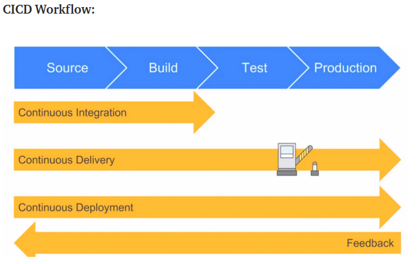

# CI/CD

### INTRODUCTION TO CI/CD

Software development life cycle.

- The process of automating tasks from development, testing to deployment with less time and lower cost. CI merge all developers working copies to a shared machine. CD functionality is added and deployed automatically if it works.

- CI/CD or CICD generally refers to the combined practices of continuous integration and either continuous delivery or continuous deployment.

- CI/CD bridges the gaps between development and operation activities and teams by enforcing automation in building, testing and deployment of applications.

- CI/CD is considered as the backbone of DevOps practices and automation. It plays vital, challenging and exciting role in DevOps culture, growing numbers of companies releasing software in minutes with the adoption of CICD practices.

Companies that use CICD pipelines:

- Facebook
- Netflix
- HP
- Adobe

- 4 Pillars: ease of use, flexibility, robustness and cost.
- DevOps helps software development and deployment SDLC.

### Software Development Life Cycle (SDLC)

- Plan/Design
- Develop
- Test
- Deploy

Nothing gets deployed without testing. We have to make sure the code is going to work before put in front of the clients.

- Problems in traditional SDLC:

    - Scale and complexity
        - Functions
        - Architecture
        - Infrastructure
        - Developers
        - Operations
    - Manual and slow process
    - Broken communication
    - Human errors
    - Large volume of testing
    - Long deployment window
    - High cost
    - Customer dissatisfaction

You debug and it doesn't work, so you lost money and wasted your time.

### DevOps in SDLC:

- DevOps came to help modern SDLC - Agile. It brings:

	- Collaboration
	- Automation
	- Iterative

- DevOps Lifecyle:


### DevOps Lifecycle Stages

How do we implement it?

- Continuous Development
- Continuous Testing
- Continuous Integration
- Continuous Delivery/Deployment
- Continuous Monitoring

__Continuos Integration (CI):__

Is the practice of merging all developers' working copies to a shared mainline several several times a day:

- Development
- Testing
- Integration

(MORE OR LESS LIKE WE DID IN OUR PROJECT WITH GIT/AGILE(DRAWING))


Process: build, test it, test done, report it, come to your source control.

__Continuos Delivery (CD or CDE):__

Is a software enginerring approach in which teams produce software in short cycles, ensuring that the software can be reliably released at any time and, when releasing the software, doing so __manually__.

__Continuos Deployment (CD):__

Is a software engineering approach in which software functionalities are delivered frequently through __automated__ deployments.

Let's see the difference:


How automation is with CD:


The important thing to understand it, is who is involved here.
QA: Quality assurance -> make sure that the test was done.
PROD: means in front of the client.

### CICD Workflow



How CICD Practices relate to each other. To put it simply, the continuous integration is part of both continuous delivery and continuous deployment. The main difference is the deployment step, in continuous delivery the deployment is done manually and in continuous deployment it happens automatically.

### CI/CD Pipeline

The CI/CD pipeline is all about automation: Initiating code builds, automated testing, and automated deploying to the staging or production environments. It’s complex and exciting at the same time, but incredibly fast, if the output of any stage fails, the next stage will also fail.

A CI/CD pipeline automates your software delivery process. The pipeline builds code, runs tests (CI), and safely deploys a new version of the application (CD).

Automated pipelines remove manual errors, provide standardized feedback loops to developers, and enable fast product iterations.


Pipeline phases:

1. Commit
2. Build
3. Automate tests
4. Deploy

Scene: we have the code, we will commit from our local host, to trigger the build, the build will trigger, will do the testing, one the testing is passed it will integrate the code for us. In cd, we will review the code, and one test is passed, we will deploy to production.

This, automate testing and automate deployment help us to save time.

Everything, we will do, DevOps.


We will use Jenkins to create CI/CD pipeline, but there are more options like Bamboo. Both work in the same way. Similar.

### CI/CD Best practices

1. Fail faster and cheaper:

The main purpose of a CI pipeline is to automate the build process. Your build process should involve version control and issue tracking. It should also integrate and run unit tests, so that builds fail for code that does not meet functional requirements.

Failing faster within a CI/CD pipeline is beneficial in terms of cost and effort since tests are expensive and are difficult to debug and can require multiple services to be running on the infrastructure. Most product teams would prefer to catch an issue before it reaches a customer.

2. Commit Daily:

Software teams should integrate their code early and often to the main branch of their code repository. This prevents maintenance hell on both feature and main branches as developers progress on feature development.

3. Fix the Broken Builds:

Continuous integration assumes your software development teams are developing on known stable versions of code. If your teams are struggling to keep your application code stable and well-tested, the best option is ensuring that your build and test process is available and visible to your development teams.

Building CI/CD pipelines to provision and control quality assurance (QA) or testing environments can be really beneficial for software development and QA teams looking to deliver with quality and speed.

4. Continuously Automate the Delivery Lifecycle:

Every organization has a process for creating and delivering code. This process may change over time due to new technologies, teams, or processes. An important practice is to continually evaluate which processes and tests need to be integrated or automated into a CI/CD pipeline.

A continuous delivery (CD) pipeline is a reflection of our software delivery life cycle (SDLC).

5. Define a Release and Rollback Strategy

A software release is a distribution of software to the consumer. Anytime we release software, we introduce the risk of vulnerabilities, issues, bugs, and non-performant software. There could be any number of reasons for rolling back a deployment or producing a hotfix. Define a release strategy that works for your CD process to reduce the risk of deployments.

### Why CI/CD matters (Benefits)

- Reduce cost
- Faster release rate
- Smaller code changes
- Fault isolations
- More test reliability
- Increase team transparency and accountability
- Easy maintenance and updates

### Conclusion

What do I help as DevOps?

- Culture
- People/teams
- Collaboration
- Principles
- Automation tools
- SDLC
- System quality
- Cost efficiency
- Business value

We bring a good culture, faster development, Agile, DevOps practices.

We are amazing people that everyone have to talk with all of us, with testers, operations, developers, etc. 

Everyone need to communicate with us. Also we need to communicate with them. We should be able to explain any technical topic in a nice way that they can understand.

We are highly in demand.

Summary: we develop something and we test it before we release it.

### Jenkins


The Jenkins master acts to schedule the jobs and assign agent node and send builds to agent to execute the jobs.

It will also monitor the agent node state (offline or online) and getting back the build result responses from agent and the display build results on the console output. The workload of building jobs is delegated to multiple agent nodes.

STEPS:

1. Clone the repository: `git clone https://github.com/name/repository.git` - ([link](https://github.com/alfonso-torres/eng84_CI_CD_Jenkins)).
2. Delete .git `rm -rf .git`.
3. And create your own repository where you will push this code.
4. Open a terminal and go to ssh folder: `cd ~/.ssh/`
5. Create a new key: `ssh-keygen -t ed25519 -C "your_email@hotmail.com"` (Command for Ubuntu). Tag with a relevant name.
6. Copy your public key: `cat namekey.pub`. Copy the output.
7. Go to your repository in github. Select `Settings` tab. Select `Deploy keys` section.
8. Click on `Add new key`. Copy the public key and put a relevant name. Click on `Add key`.
9. Go to Jenkins server and log in.
10. Click `New Item`. 
11. Enter an item name: `jose_CI`. Select the option `Freestyle project`. Click `Ok`.
12. Description: `Whatever you want, relevant for the task.` (Building continuos integration by cloning the repository from github).
13. Tick on`Discard old builds`. In `Maxim of builds to keep` enter `2`.
14. Tick on `GitHub Project`. Copy the https from your repository and paste it in the gap `Project url`.
15. In the option `Office 365 Connector`, we want to restrict, so tick on `Restrict where this project can be run`. In the `label expression` select the correct node where you want to run it.
16. In `Source Code Management`, we use Git. Go back to your repository and copy the ssh link. Go back and Jenkins and past it the `Repository URL`.
17. Now, we need the credentials. Click on `Add`.
18. Click on `Kind` and select the option of SSH.
19. Open a terminal and go to ssh folder: `cd ~/.ssh/`. Now we need copy our private key.
20. Come back to jenkins and paste it the section of `Private key`. Add a username to identify later your key. Click on `Add`.
21. So, in `Credentials` select the key that we have added. It should resolve any problem.
22. In `Branch Specifier` change to `*/main`.
23. In `Build Triggers`, tick on `GitHub hook trigger for GITScm polling`.
24. In `Build Environment`, tick on `Provide Node & npm bin/ folder to PATH`. Leave that at it is.
25. In `Build`, select the option `Execute shell` and add the following commands: 

````
cd app
npm install
npm test
````

Jenkins is going to clone the repository and go to app folder and run the commands. It will automate the tests.

26. Click on `Apply` and then `Save`.
27. Let's go and click on `Build now`. When it has finished, check if it passed all the tests and the app is running. It did everything for us. Jenkins go to github and clone the repository using the key.
28. Let's go back to the repository in github. Click on `Settings`.
29. Click on `Webhooks`. Use of webhooks that are triggered on github push. Note: we need to enable Github webhooks on the Jenkins Project.
30. Copy the IP of your jenkins server including the port.
31. Click on `Add webhook`
32. In URL: `http://ip:port/github-webhook/`.
33. In type select `json`.
34. Tick on `send me everything`. And finally `Add webhook`.
35. Open your terminal, go to the folder of your repository.
36. Make some changes (for example, modify readme). Push it.
37. Github receive the change, the webhook is going to listen it and trigger the build in jenkins, so jenkins is going to do the rest (run the test and give the result).
38. Go to jenkins to the project and you will see that it build again everything. Check if it was successfully. It triggered.

__Deployment Lab__

We've followed some manual steps to get our code on to the production environment. But we should really automate this process.

Create a new jenkins job called Your Name Deploy. Set it up so that it performs the steps you just ran through.

Set this job to run when the CI testing job has finished successfully.

Make a change to the homepage of the app and push your code to the develop branch to test out your pipeline.

- __Tasks:__

- Job to automatically build and test app on new commit to dev branch (The same steps like we did before but change the main branch for dev branch).
- Job to merge dev to main branches.
- Job to deploy on AWS EC2 once the code is merged to main.

- __Notes & tips:__

This job should pull from the main branch only.

There are many tools and methods for uploading files to a remote server. We want to keep it simple and use rsync and ssh as we've learned previously. Do not use the Publish over SSH plugins.

You can create this configuration entirely in your job using:

````
ssh
rsync
ssh-agent
credentials system
````

When jenkins attempts to connect via SSH it will ask for confirmation as we saw in the lesson. We can ask it to skip this confirmation with the following flags:

````
ssh -o "StrictHostKeyChecking=no" ubuntu@ ...
rsync -avz -e "ssh -o StrictHostKeyChecking=no" ...
````

You can send multiple commands over ssh with the following syntax

````
ssh -o "StrictHostKeyChecking=no" ubuntu@52.50.22.47 <<EOF
    
    # commands here...

EOF
````

- __Acceptance Criteria:__

- Is it's own job on Jenkins.
- Trigger is set to successful merge and publish of code.
- Automatically transfer files into live server on EC2.

- __Solution:__

To be able to create this pipeline, we have to create 3 Jenkins `Freestyle Projects`:

- The first job `jose_CI_test`, is called via a webhook from github, which is triggered when a push occured. The goal is to push from the `dev` branch. We will repeat the same steps like we did before but instead of the `main` branch we will change that for the `dev` branch.

- The second job, if the first job succeeds, then the jon `jose_merge` will be called to start the executing. In the merge job, the github `dev` branch is merged with the main branch. To achieve this, an ssh key had to be deployed to the github project, so that Jenkins has the credentials for administrative access. This allows Jenkins to merge the files. Let's go on with the steps:

1. Create a new project (Freestyle) and named it `jose_merge`.
2. Description: `job to merge CI from dev to main`.
3. Tick on`Discard old builds`. In `Maxim of builds to keep` enter `2`.
4. Tick on `GitHub Project`. Copy the https from your repository and paste it in the gap `Project url`.
5. In the option `Office 365 Connector`, we want to restrict, so tick on `Restrict where this project can be run`. In the `label expression` select the correct node where you want to run it.
6. In `Source Code Management`, we use Git. Go back to your repository and copy the ssh link. Go back and Jenkins and past it the `Repository URL`.
7. Now, we need the credentials. Click on `Add`.
8. Click on `Kind` and select the option of SSH.
9. Open a terminal and go to ssh folder: `cd ~/.ssh/`. Now we need copy our private key.
10. Come back to jenkins and paste it the section of `Private key`. Add a username to identify later your key. Click on `Add`.
11. So, in `Credentials` select the key that we have added. It should resolve any problem.
12. In `Branch Specifier` change to `*/dev`.
13. In `Build Environment`, tick on `Provide Node & npm bin/ folder to PATH`. Leave that at it is.
14. In `Post-build Actions`, select `Git Publisher`.
15. Tick on `Push onlu if build suceeds`.
16. In `Branches` section, in the `branch to push` write down `main`, and in `target remote name` write down `origin`. It is ogin to merge to the main branch.
17. Click on `Apply` and `Save`.
18. Go back to the last project `jose_CI_test`. In the section `Post-build Actions`, select `Build other projects`.
19. In the gap `project to build`, select your new project `jose_merge` and tick on `trigger only if build is stable`.
20. Click on `Save` and we have our two projects ready to merge.
21. Open a terminal, go to your folder of the repository in your local machine. Create a new branch `git branch dev`. Swap to the branch `git checkout dev`, modify some files, for example README file and push it from the dev branch like always.
22. Go back to the Jenkins dashboard and check that both jobs, firstly `jose_CI_test`, and then `jose_merge` have finished successfully. And finally go to the your github repository of the project and check te commits. You will see that the new updates was merged to the main branch.

Second task done. Successful merge.

- Finally, if the second job succeeds, the third is triggered, wheren a `ssh` connection is established with the EC2 instance where the application is hosted. When the connection is established within the new job of jenkins, the necessary commands are executed to copy the newly edited files to the instance in order to deploy the app. We will restart the nodejs application to have the app available for the clients. Let's go on with the steps:

1. Create a new project (Freestyle) and named it `jose_deploy`.
2. Description: `let's do the deployment test in an instance of AWS`.
3. Tick on`Discard old builds`. In `Maxim of builds to keep` enter `2`.
4. Tick on `GitHub Project`. Copy the https from your repository and paste it in the gap `Project url`.
5. In the option `Office 365 Connector`, we want to restrict, so tick on `Restrict where this project can be run`. In the `label expression` select the correct node where you want to run it.
6. In `Source Code Management`, we use Git. Go back to your repository and copy the ssh link. Go back and Jenkins and past it the `Repository URL`.
7. Now, we need the credentials. Click on `Add`.
8. Click on `Kind` and select the option of SSH.
9. Open a terminal and go to ssh folder: `cd ~/.ssh/`. Now we need copy our private key.
10. Come back to jenkins and paste it the section of `Private key`. Add a username to identify later your key. Click on `Add`.
11. So, in `Credentials` select the key that we have added. It should resolve any problem.
12. In `Branch Specifier` change to `*/main` for the reason we have merged the project to main branch in the last step.
13. In `Build Environment`, tick on `Provide Node & npm bin/ folder to PATH`. Leave that at it is.
14. In `Build Environment`, also tick on `SSH Agent`.
15. In credentials, we need to add the key regarding AWS, to be able to establish the connection with ssh from jenkins to AWS. Click on `Add` and do the same steps like we did before but with the new key. After adding, select the key in the gap.
16. In `Build`, select the option `Execute shell`. We are going to execute the commands in order to synchronize the code, which has been previously unified, to the instance where we are going to launch the application. We will connect remotely and then we will launch the application. Adding this commands to run in the section `Command`:

````bash
rm -rf eng84_CI_CD_Jenkins*
git clone -b main https://github.com/name/repository.git
cd eng84_CI_CD_Jenkins
rsync -avz -e "ssh -o StrictHostKeyChecking=no" app ubuntu@public_ip_app:/home/ubuntu/app
#rsync -avz -e "ssh -o StrictHostKeyChecking=no" environment ubuntu@52.50.22.47:/home/ubuntu/app

ssh -A -o "StrictHostKeyChecking=no" ubuntu@public_ip_app <<EOF

    killall npm

    cd app/app
    sudo npm install
    nodejs seed/seed.js

    nodejs app.js &

EOF
````

17. Click on `Apply` and then `Save`.
18. Go back to the project `jose_merge`. In the section `Post-build Actions`, select `Build other projects` and add the project that we have created right now `jose_deploy`. Tick on `Trigger only if build is stable`.
19. Save it.
20. Go to check if the instance is running correctly in AWS and also check the rules to be able to connect ssh. Add the ip of the jenkins server in order to connect from there. Add the public ip of the app instance in the commands that we have added in the last project in jenkins.
21. Let's check in the whole pipeline is working properly. Open a terminal and go to the folder of the project. Make sure you are in the `dev` branch. Modify something in the main view and push it.
22. Go back the jenkins dashboard and check one by one that the three projects have finished successfully. In the last one, check that the application is working correctly.
23. Go to the browser and enter the public ip of the app instance to verify that the app is running and that you can see the changes of the main view you have done recently.

If it is the case, congratulations, you have made your CI/CD pipeline!
